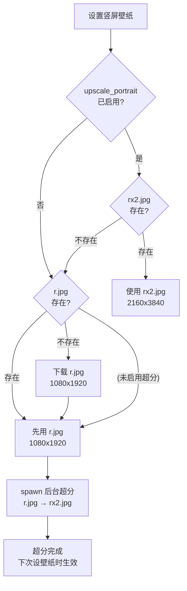

# 竖屏壁纸超分至 4K 集成方案

## 背景

当前竖屏壁纸分辨率硬编码为 `1080x1920`（Bing API 最高只提供这个），横屏可获取 UHD。
对于 4K 竖屏显示器，需要通过 AI 超分将 1080p 提升到 2160x3840。

采用外部 CLI 方案：用户自行安装 `waifu2x-ncnn-vulkan`，app 自动检测并调用。

### 工具选型：waifu2x-ncnn-vulkan

- 活跃维护：2025 年发布 3 个版本，最新 20250915
- 包管理器覆盖好：Windows `scoop`，Linux `snap` / AUR
- macOS 提供预编译 binary，支持 Apple Silicon
- 3.3k stars，MIT 许可证

### 用户安装方式（写入设置页引导文案）

- **Windows**: `scoop install waifu2x-ncnn-vulkan`
- **Linux (Debian/Ubuntu)**: `snap install waifu2x-ncnn-vulkan`
- **Linux (Arch)**: `yay -S waifu2x-ncnn-vulkan-git`
- **macOS**: 从 [GitHub Releases](https://github.com/nihui/waifu2x-ncnn-vulkan/releases) 下载

### 确认的 CLI 参数（经实测 + 源码验证）

```bash
waifu2x-ncnn-vulkan -i YYYYMMDDr.jpg -o YYYYMMDDrx2.jpg -s 2 -n -1 -m models-upconv_7_photo -f jpg
```

- JPG 输出质量为 98 + 4:4:4 色度（源码确认），肉眼无损
- `-n -1` 关闭降噪，`-m models-upconv_7_photo` 照片专用模型

## 文件命名策略

超分文件使用独立文件名，`x2` 后缀暂时写死，后续可扩展：

| 文件 | 说明 | 来源 |
|------|------|------|
| `YYYYMMDDr.jpg` | 原始竖屏 1080x1920 | Bing API 下载 |
| `YYYYMMDDrx2.jpg` | 超分后 2160x3840 | waifu2x 生成 |

### 壁纸设置时的查找优先级

```
if upscale_portrait 已启用:
    rx2.jpg 存在 → 用它
    rx2.jpg 不存在，r.jpg 存在 → 本次先用 r.jpg，后台 spawn 超分
    r.jpg 也不存在 → 下载 r.jpg，本次先用 r.jpg，后台 spawn 超分
else:
    r.jpg 存在 → 用它
    r.jpg 不存在 → 下载 r.jpg
```

### 设计优势

- 原始文件始终保留，关闭超分立即切回原图
- 下载逻辑（`r.jpg`）完全不动
- 超分全程后台，不阻塞壁纸设置
- 文件名可扩展（`rx3.jpg`、`rx4.jpg`）

## 数据流



关键：超分是 spawn 出去的后台任务，壁纸设置不等待它完成。
超分完成后，下一次壁纸更新周期或手动刷新时会自动使用 `rx2.jpg`。

## 一、新增 Rust 模块 `src-tauri/src/upscaler.rs`

负责检测和调用 waifu2x，与主逻辑解耦。

### 核心函数

**`find_waifu2x_binary(custom_path: Option<&str>) -> Option<PathBuf>`**
- 如果 `custom_path` 有值：验证文件存在并返回
- 否则从系统 PATH 搜索 `waifu2x-ncnn-vulkan`（Windows 上加 `.exe`）

**`upscale_image(binary: &Path, input: &Path) -> Result<PathBuf>`**
- 从 input 路径推导输出路径：`YYYYMMDDr.jpg` → `YYYYMMDDrx2.jpg`
- 先输出到临时文件 `YYYYMMDDrx2_tmp.jpg`
- 调用 CLI：`-i <input> -o <tmp> -s 2 -n -1 -m models-upconv_7_photo -f jpg`
- 成功后原子 rename `rx2_tmp.jpg` → `rx2.jpg`，返回 `rx2.jpg` 路径
- 失败时清理临时文件，返回 error

**`is_waifu2x_available(custom_path: Option<&str>) -> bool`**
- 供前端调用，检查工具是否可用

**`portrait_upscaled_path(portrait_path: &Path) -> PathBuf`**
- 辅助函数：`YYYYMMDDr.jpg` → `YYYYMMDDrx2.jpg`
- 供 update_cycle / wallpaper_manager 等调用

## 二、Settings 模型变更

### Rust 侧 `src-tauri/src/models/settings.rs`

在 `AppSettings` 结构体中新增：

```rust
#[serde(default)]
pub upscale_portrait: bool,            // 是否启用竖屏超分，默认 false

#[serde(default)]
pub upscaler_path: Option<String>,     // 自定义 waifu2x 路径，默认 None（从 PATH 检测）
```

### TypeScript 侧 `src/types/index.ts`

```typescript
upscale_portrait: boolean;
upscaler_path: string | null;
```

## 三、新增 Tauri Command

在 `src-tauri/src/commands/` 中新增：

```rust
#[tauri::command]
pub async fn check_upscaler_available(app: AppHandle) -> Result<bool, String>
```

从当前设置读取 `upscaler_path`，调用 `upscaler::is_waifu2x_available()` 返回结果。

在 `src-tauri/src/lib.rs` 中注册该命令。

## 四、壁纸流程集成

### 需要修改的文件和职责

| 文件 | 修改内容 |
|------|---------|
| `update_cycle.rs` | 下载 `r.jpg` 后 spawn 后台超分；设壁纸时按优先级选文件 |
| `wallpaper_manager.rs` | 构建 portrait 路径时，启用超分则优先返回 `rx2.jpg` |
| `commands/wallpaper.rs` | `set_desktop_wallpaper` 时优先用 `rx2.jpg`，不存在则 spawn 超分并先用 `r.jpg` |
| `transfer.rs` | 导入导出时同时识别和复制 `rx2.jpg` 文件 |
| `download_manager.rs` | **不改动**，仅负责下载 `r.jpg` |

### update_cycle.rs 核心改动

```rust
// 竖屏壁纸下载完成后（现有的 spawn 块中）
// 超分本身也在 spawn 内，不阻塞任何主流程
if settings.upscale_portrait {
    let rx2_path = upscaler::portrait_upscaled_path(&portrait_file_path);
    if !rx2_path.exists() {
        if let Some(binary) = upscaler::find_waifu2x_binary(
            settings.upscaler_path.as_deref()
        ) {
            let input = portrait_file_path.clone();
            tauri::async_runtime::spawn(async move {
                match upscaler::upscale_image(&binary, &input).await {
                    Ok(path) => log::info!("Portrait upscaled: {}", path.display()),
                    Err(e) => log::warn!("Upscale failed, will use original: {e}"),
                }
            });
        }
    }
}

// 设壁纸时选择文件（现有 portrait_path 构建处）
// 仅检查文件是否存在，不等待超分
let portrait_path = if settings.upscale_portrait {
    let rx2 = upscaler::portrait_upscaled_path(&original_portrait_path);
    if rx2.exists() { rx2 } else { original_portrait_path }
} else {
    original_portrait_path
};
```

关键设计：超分通过 `tauri::async_runtime::spawn` 在独立任务中运行，
不阻塞壁纸下载、壁纸设置、UI 响应中的任何环节。
超分完成后的 `rx2.jpg` 在下一次壁纸更新周期或手动刷新时自动生效。

## 五、前端 Settings UI

### 在 `src/components/Settings.tsx` 中新增"竖屏超分"设置区域

放在"保存目录"设置之后，包含：

1. **开关**：「竖屏壁纸超分至 4K」toggle
   - 开启时调用 `check_upscaler_available` 检测工具
   - 未检测到时显示警告信息（含各平台安装指引）
2. **自定义路径**（可选）：当自动检测失败时，允许手动指定 waifu2x 路径
   - 使用文件选择对话框
   - 选择后再次验证可用性

### 翻译 `src/i18n/translations.ts`

新增键值：

- `upscalePortrait`: 竖屏壁纸超分至 4K / Upscale portrait wallpaper to 4K
- `upscalePortraitDesc`: 使用 waifu2x 将竖屏壁纸从 1080p 放大至 4K / Use waifu2x to upscale portrait wallpaper from 1080p to 4K
- `upscalerNotFound`: 未检测到 waifu2x / waifu2x not found
- `upscalerNotFoundDesc`: 请安装 waifu2x-ncnn-vulkan 并确保在 PATH 中，或手动指定路径 / Please install waifu2x-ncnn-vulkan and ensure it's in PATH, or specify the path manually
- `upscalerInstallHint`: Windows: scoop install waifu2x-ncnn-vulkan / ...
- `upscalerPath`: waifu2x 路径 / waifu2x path
- `upscalerDetected`: 已检测到 waifu2x / waifu2x detected
- `specifyPath`: 指定路径 / Specify path

## 六、关键设计决策

- **不阻塞**：超分通过 `spawn` 在独立后台任务运行，壁纸设置、下载、UI 均不等待
- **文件策略**：独立文件名 `rx2.jpg`，原始 `r.jpg` 始终保留不动
- **查找优先级**：启用超分时 `rx2.jpg` → `r.jpg`；关闭超分时仅 `r.jpg`
- **错误处理**：超分失败仅 log::warn，不影响任何正常流程
- **生效时机**：超分完成后的 `rx2.jpg` 在下一次更新周期或手动刷新时自动生效
- **幂等性**：`rx2.jpg` 已存在则跳过超分
- **CLI 参数**：`-s 2 -n -1 -m models-upconv_7_photo -f jpg`（2x 放大，关降噪，照片模型，JPG quality 98）
- **仅支持 waifu2x**：不做多工具兼容，降低复杂度

## 七、实现任务清单

1. 创建 `src-tauri/src/upscaler.rs` 模块（find / upscale / helpers）
2. 在 `src-tauri/src/models/settings.rs` + `src/types/index.ts` 新增设置字段
3. 新增 `check_upscaler_available` Tauri command 并在 `lib.rs` 注册
4. 修改 `update_cycle.rs`：下载后 spawn 超分 + 设壁纸时按优先级选文件
5. 修改 `wallpaper_manager.rs` / `commands/wallpaper.rs`：portrait 路径解析加入 `rx2` 优先级
6. 修改 `transfer.rs`：导入导出识别并复制 `rx2.jpg` 文件
7. 在 `Settings.tsx` 中添加超分设置 UI（开关 + 状态检测 + 自定义路径）
8. 在 `translations.ts` 中添加超分相关的中英文翻译
9. 为 upscaler 模块添加单元测试
