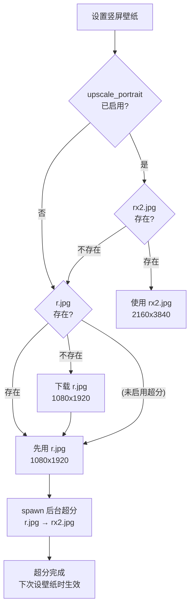

# 竖屏壁纸超分至 4K 集成方案

## 状态：暂缓，等待扩散模型 API 成熟

经过实测评估（2026.03），当前没有同时满足"效果好 + 用户门槛低 + 可集成到桌面应用"
的超分方案。决定暂时搁置此功能，等待扩散模型云端 API 进一步成熟后再重新评估。

## 背景

当前竖屏壁纸分辨率硬编码为 `1080x1920`（Bing API 最高只提供这个），横屏可获取 UHD。
对于 4K 竖屏显示器，需要通过 AI 超分将 1080p 提升到 2160x3840。

## 技术调研结论

### 一、GAN 超分（本地 CLI）—— 效果不达标

实测了以下 GAN 方案，均存在**过度平滑**问题（树叶等自然纹理变成模糊色团）：

| 工具 | 模型 | 速度 (M3 Pro) | 问题 |
|------|------|--------------|------|
| waifu2x-ncnn-vulkan | models-upconv_7_photo | 0.7s/张 | 动漫模型，照片效果差 |
| upscayl-ncnn (Real-ESRGAN) | realesrgan-x4plus | 30s/张 | 照片模型，但过度平滑自然纹理 |
| upscayl-ncnn | 4x_NMKD-Superscale-SP | 32s/张 | 细节略好但仍不够 |
| upscayl-ncnn | 4xNomos8kSC | 32s/张 | 同上 |
| upscayl-ncnn | 4xLSDIRplusC | 30s/张 | 同上 |

GAN 的本质局限：当原图每片树叶只有 2-3 像素时，GAN 没有足够信息推断应有的形状，
倾向输出"安全的平均值"（模糊色团）。这是 GAN 架构的固有缺陷，换模型无法根本解决。

实测使用新天鹅堡壁纸（20260126r.jpg，雪天城堡+树林），realesrgan-x4plus 综合最佳
但仍无法令人满意。

### 二、扩散模型超分 —— 效果好但无法可用地集成

扩散模型通过"理解内容后重新生成细节"来超分，能产生 GAN 做不到的精细纹理。

#### 本地方案

| 模型 | 底层 | 显存需求 | Mac 18GB 可行 | 许可证 |
|------|------|---------|--------------|--------|
| CCSR v2 | SD 2.1 base | ~8-10GB (fp16+tile) | 理论可行但不稳定 | Apache 2.0 |
| SUPIR | SDXL | 12-60GB | 不可行 | 非商用 |
| StableSR | SD 1.5 | ~8GB | 勉强 | 研究用 |

本地扩散模型的问题：
- 需要用户安装 Python + PyTorch + 数 GB 模型文件，门槛过高
- Mac MPS 后端不稳定，大图容易崩溃
- 作为桌面壁纸应用的外部依赖完全不现实

#### 云端 API

| 服务 | 技术 | 单价 | 速度 | 质量 | 年成本 (1张/天) |
|------|------|------|------|------|----------------|
| Recraft Crisp | 闭源，锐化增强 | $0.004/张 | 快 | 高 | ~10 元 |
| Clarity Upscaler | SD+ControlNet Tile | $0.017/张 | ~15s | 很高 | ~44 元 |
| SUPIR v0F | SUPIR 保真模式 | $0.12/张 | ~2min | 极高 | ~320 元 |
| Google Imagen 4.0 | Imagen 大模型 | $0.04/张 | 几秒 | 极高 | ~106 元 |
| Recraft Creative | 闭源，生成式超分 | $0.25/张 | 中 | 很高 | ~665 元 |
| SUPIR v0Q | SUPIR 质量模式 | $0.41/张 | ~5min | 最高 | ~1090 元 |
| Magnific AI | 闭源专有 | $39/月起 | 中 | 顶级 | 订阅制，无法按张调用 |

云端 API 的问题：
- 需要用户自备 API key（Replicate / GCP 等）
- 需要海外网络访问
- 壁纸应用引入云端 API 依赖增加了复杂度和不确定性
- 国内云服务（阿里云/腾讯云/百度）底层仍是 Real-ESRGAN，效果无提升

### 三、技术代际差异总结

```
第一代 传统插值 (Bicubic/Lanczos)
  → 均匀模糊，不会出错但也不增加任何细节

第二代 GAN 超分 (Real-ESRGAN / waifu2x)
  → 确定性、快、但过度平滑自然纹理（树叶成团）
  → 不会凭空创造，只基于已有像素推断

第三代 扩散模型超分 (SUPIR / Clarity / CCSR)
  → 理解图片内容后重新生成细节（"知道是树，画出合理叶片"）
  → 能创造 GAN 做不到的精细纹理
  → 但慢、显存需求大、可能产生幻觉（细节是编的）
```

对于壁纸场景（需要好看，不需要像素级还原），扩散模型是正确方向。

## 搁置原因

1. **GAN 效果不达标**：树叶等自然纹理过度平滑，经实测无法通过换模型解决
2. **本地扩散模型门槛过高**：需要 Python + PyTorch + 数 GB 模型，Mac 上不稳定
3. **云端 API 引入过多外部依赖**：需要 API key + 海外网络，不适合桌面应用
4. **功能优先级**：1080p 竖屏壁纸虽不完美但可用，超分是锦上添花

## 未来重新评估的触发条件

以下任一条件满足时可重新启动此方案：

1. **ncnn/vulkan 出现扩散模型实现**：类似 Real-ESRGAN-ncnn-vulkan 的轻量级本地 CLI，
   用户只需下载一个二进制即可使用，无需 Python 环境
2. **Replicate / 国内云服务价格进一步下降**：且提供免 API key 的集成方式
3. **Apple MLX 生态成熟**：能稳定跑扩散超分且有简单 CLI 封装
4. **SD 系模型进一步轻量化**：CCSR 类模型出现 1-2GB 级别的量化版本，
   可在 8GB 设备上稳定运行

## 备用方案设计（保留，便于后续快速实现）

以下设计在未来重新启动时可直接复用：

### 文件命名策略

超分文件使用独立文件名，`x2` 后缀暂时写死，后续可扩展：

| 文件 | 说明 | 来源 |
|------|------|------|
| `YYYYMMDDr.jpg` | 原始竖屏 1080x1920 | Bing API 下载 |
| `YYYYMMDDrx2.jpg` | 超分后 2160x3840 | 超分工具生成 |

### 壁纸设置时的查找优先级

```
if upscale_portrait 已启用:
    rx2.jpg 存在 → 用它
    rx2.jpg 不存在，r.jpg 存在 → 本次先用 r.jpg，后台 spawn 超分
    r.jpg 也不存在 → 下载 r.jpg，本次先用 r.jpg，后台 spawn 超分
else:
    r.jpg 存在 → 用它
    r.jpg 不存在 → 下载 r.jpg
```

### 设计原则

- **不阻塞**：超分通过 `spawn` 在独立后台任务运行
- **文件策略**：独立文件名 `rx2.jpg`，原始 `r.jpg` 始终保留不动
- **查找优先级**：启用超分时 `rx2.jpg` → `r.jpg`；关闭时仅 `r.jpg`
- **错误处理**：超分失败仅 log::warn，不影响正常流程
- **幂等性**：`rx2.jpg` 已存在则跳过超分

### 数据流


```mermaid
flowchart TD
    Start["设置竖屏壁纸"]
    Enabled{"upscale_portrait\n已启用?"}
    HasRx2{"rx2.jpg\n存在?"}
    HasR{"r.jpg\n存在?"}
    Download["下载 r.jpg\n1080x1920"]
    UseRx2["使用 rx2.jpg\n2160x3840"]
    UseR["先用 r.jpg\n1080x1920"]
    SpawnUpscale["spawn 后台超分\nr.jpg → rx2.jpg"]
    UpscaleDone["超分完成\n下次设壁纸时生效"]

    Start --> Enabled
    Enabled -->|否| HasR
    Enabled -->|是| HasRx2
    HasRx2 -->|存在| UseRx2
    HasRx2 -->|不存在| HasR
    HasR -->|存在| UseR
    HasR -->|不存在| Download
    Download --> UseR
    UseR --> SpawnUpscale
    SpawnUpscale --> UpscaleDone
    HasR -->|"(未启用超分)"| UseR
```
